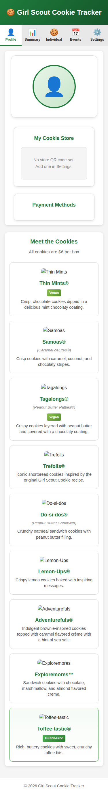
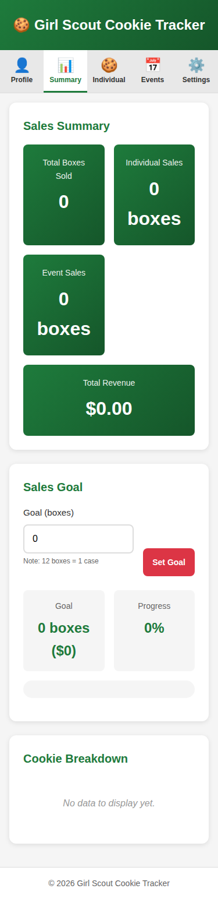
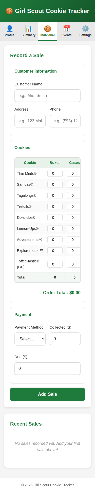
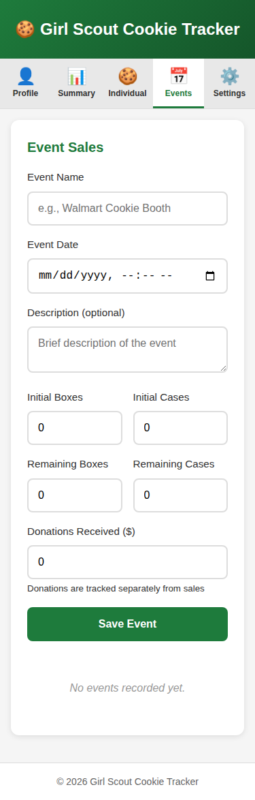

# Apex Scout Manager v2.0
Full Troop Management Software with Multi-User Support

A mobile-responsive web application for tracking cookie sales and managing scout troops. Designed to work seamlessly on both Android and iPhone devices with multi-user authentication and role-based access control.

## Version 2.0 Features

### 👥 Multi-User & Authentication
- **User Authentication**: Secure login with email/password and Google OAuth 2.0
- **Role-Based Access Control**: Scout, Parent, Troop Leader, and Council Admin roles
- **Session Management**: Secure HTTP-only cookies with IP tracking
- **COPPA Compliance**: Age verification and parental consent tracking for minors
- **Audit Logging**: Complete action history for compliance and security

### 🏕️ Troop Management
- **Troop Organization**: Create and manage multiple troops within your council
- **Scout-Parent Linking**: Connect scouts with parent accounts for family management
- **Scout Levels**: Support for all Girl Scout levels (Daisy through Ambassador)
- **Role-Based Permissions**: Granular permissions for troop leaders, treasurers, and assistants
- **Troop Goals**: Set and track goals for sales, participation, and fundraising

### 🍪 Sales & Inventory Management
- **Track Cookie Sales**: Record sales by cookie type, quantity, customer, and payment status
- **Event Management**: Track booth sales with per-cookie inventory tracking
- **Inventory Control**: Real-time on-hand inventory tracking by cookie type
- **Payment Status Tracking**: Complete delivery status for orders (in-person, shipped, shipped/pending delivery, awaiting payment)
- **Excel Import/Export**: Bulk upload orders and export sales reports

### 📊 Analytics & Reporting
- **Sales Summary**: View total boxes sold, revenue, and donation stats at a glance
- **Cookie Breakdown**: See which cookies are selling best
- **Event Analytics**: Track booth performance and seasonal trends
- **User Isolation**: Multi-user data isolation - users only see their own sales

### 💳 Payment & Donations
- **Payment Methods**: Manage multiple payment options (Venmo, PayPal, etc.) with dynamic QR code generation
- **Donation Tracking**: Record donations with donor information
- **Payment Status**: Track which orders are paid vs pending

### 👤 Profile Management
- **Scout Profile**: Personalize with photo, goal tracking, and shareable store/payment links
- **Multi-User Profiles**: Each user has their own independent profile and settings
- **Photo Upload**: Store and display scout photos

### 💾 Data Management
- **Persistent Data**: SQLite database storage for reliable data management
- **Data Backups**: Automatic timestamped database backups on startup
- **Import/Export**: Excel-based import/export for bulk operations
- **Bulk Operations**: Delete multiple sales at once

### 🎨 User Experience
- **Mobile-First Design**: Optimized for phone screens with responsive layout
- **Dark Mode Support**: Automatically adapts to system dark mode preference
- **PWA-Ready**: Add to home screen on iOS and Android for native-like experience
- **Touch-Friendly**: 48px minimum touch targets following accessibility guidelines
- **Cross-Browser Compatible**: Works on all modern browsers

## Screenshots

### Mobile View - Profile Tab


### Mobile View - Summary Tab


### Mobile View - Individual Sales Tab


### Mobile View - Events Tab


### Mobile View - Settings Tab


## Cookie Types Included (2026 Season)

**Classic Cookies:**
- Thin Mints® - Crisp chocolate cookies with mint coating (vegan)
- Samoas® / Caramel deLites® - Cookies with caramel, coconut, and chocolate
- Tagalongs® / Peanut Butter Patties® - Peanut butter layered cookies with chocolate
- Trefoils® / Shortbread - Classic shortbread cookies
- Do-si-dos® / Peanut Butter Sandwich - Oatmeal cookies with peanut butter filling
- Lemon-Ups® - Crispy lemon cookies with inspiring messages
- Lemonades® - Shortbread with tangy lemon icing
- Adventurefuls® - Brownie-inspired cookies with caramel crème and sea salt

**NEW for 2026:**
- Exploremores™ - Rocky road ice cream-inspired sandwich cookies

**Gluten-Free Options:**
- Toffee-tastic® - Buttery cookies with toffee bits (gluten-free)
- Caramel Chocolate Chip - Chewy cookies with caramel and chocolate (gluten-free)

**Note:** Cookies are typically $6 per box, but prices may vary by region ($5-$7).

## Quick Start

### Using Docker (Recommended - Production)

The easiest way to run Apex Scout Manager is using Docker with the pre-configured setup:

```bash
# Navigate to Docker config directory
cd /data/DockerConfigs

# Start the application
docker compose up -d asm

# Access at http://localhost:8282
```

**First Login:**
- Default admin account created during database migration
- Email: `admin@asm.local`
- Use "Sign Up" to create additional user accounts or login with Google OAuth

### Local Development (Testing - Port 5151)

For local development and testing:

```bash
# Navigate to ASM directory
cd /data/ASM

# Start the application
docker compose up -d

# Access at http://localhost:5151
```

### Without Docker (Manual Setup)

Since Apex Scout Manager uses a Node.js backend with SQLite, you cannot just open `index.html`.

1. **Install Dependencies:**
   ```bash
   npm install
   ```
2. **Configure Environment:**
   ```bash
   cp .env.example .env
   # Edit .env with your settings (SESSION_SECRET, CORS_ORIGIN, etc.)
   ```
3. **Start the Server:**
   ```bash
   npm start
   ```
4. **Access the App:**
   Open [http://localhost:3000](http://localhost:3000) in your browser.

## Configuration

### Initial Setup
1. **First Access**: Create an admin account or login with existing credentials
2. **Organization Hierarchy**: Set up your council and troops
3. **User Management**: Invite scouts, parents, and troop leaders
4. **Scout Levels**: Assign appropriate scout levels to members

### Payment Methods
1. Go to **Settings** → **Payment Methods**
2. Add your payment providers (e.g., Venmo, PayPal) and their profile URLs
3. The **Profile** tab will automatically generate and display QR codes for each method

### Environment Configuration
For production deployment, update `/data/DockerConfigs/ASM/.env`:
- `SESSION_SECRET`: Generate a secure random string
- `CORS_ORIGIN`: Set to your production domain
- `GOOGLE_CALLBACK_URL`: Update to your production domain with `/api/auth/google/callback`
- `NODE_ENV`: Set to `production` when using HTTPS

## Mobile Access

For the best mobile experience:

### iOS (iPhone/iPad):
1. Open the app URL in Safari (e.g., `http://your-server:3000`)
2. Tap the share button
3. Select "Add to Home Screen"
4. Access the tracker like a native app from your home screen

### Android:
1. Open the app URL in Chrome (e.g., `http://your-server:3000`)
2. Tap the menu (three dots)
3. Select "Add to Home Screen"
4. Access the tracker from your home screen

## Technical Details

- **Backend**: Node.js with Express server
- **Database**: SQLite (better-sqlite3) for persistent data storage
- **Frontend**: Pure HTML/CSS/JavaScript
- **API**: RESTful endpoints for CRUD operations
- **Logging**: Winston with daily rotation and colored output (see [LOGGING.md](LOGGING.md))
- **Responsive Design**: Uses CSS Grid, Flexbox, and media queries
- **Cross-Browser Compatible**: Works on all modern browsers
- **Viewport Optimized**: Proper meta tags for mobile rendering
- **Touch-Friendly**: 48px minimum touch targets following accessibility guidelines

## Browser Support

- iOS Safari 12+
- Android Chrome 80+
- Desktop Chrome, Firefox, Safari, Edge (latest versions)

## Data Storage

All data is stored in a SQLite database (`asm.db`) in the `/data` directory. The database is persistent across container restarts when using the Docker volume mount. The application uses a Node.js backend with Express to serve the web interface and provide REST API endpoints for data operations.

## Logging

Apex Scout Manager includes comprehensive error logging with:
- Colored console output (green for info, yellow for warnings, red for errors)
- Automatic daily log rotation
- 7-day log retention
- Separate error log files

Logs are stored in `/data/logs/` and are included in the Docker volume mount. For more details, see [LOGGING.md](LOGGING.md).

## Changelog

For a detailed history of changes, features, and fixes, see [CHANGELOG.md](CHANGELOG.md).

The changelog is automatically updated when pull requests are merged. Contributors should:
- Use descriptive PR titles (they become changelog entries)
- Add appropriate labels (`feature`, `bug`, `documentation`, etc.)
- Follow conventional commit prefixes (`feat:`, `fix:`, `docs:`, etc.)
