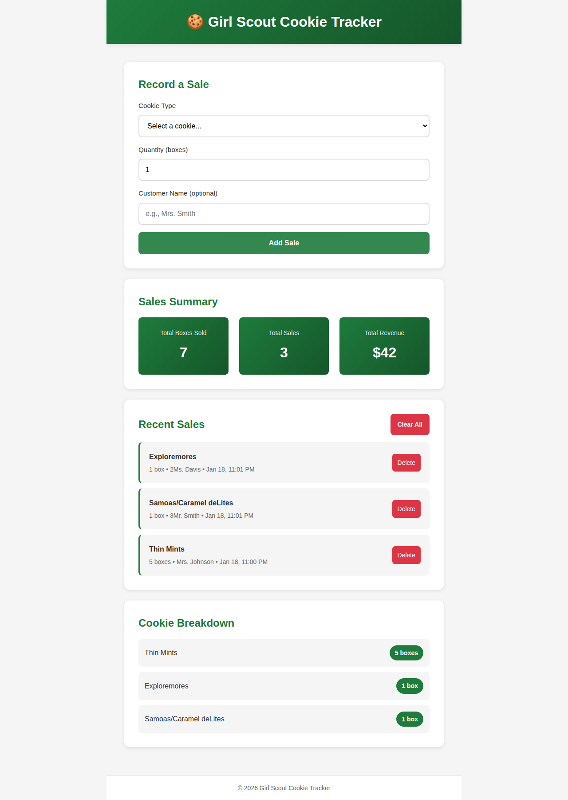
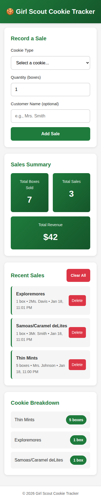

# GSCTracker
Girl Scout Cookie Tracker

A mobile-responsive web application for tracking Girl Scout Cookie sales. Designed to work seamlessly on both Android and iPhone devices.

## Features

- 📱 **Mobile-First Design**: Optimized for phone screens with responsive layout
- 🍪 **Track Cookie Sales**: Record sales by cookie type, quantity, customer, and payment status
- 🔄 **Digital Cookie Sync**: Automatically import orders from the Girl Scouts Digital Cookie platform
- 💳 **Payment Methods**: Manage multiple payment options (Venmo, PayPal, etc.) with dynamic QR code generation
- 📅 **Event Management**: Track booth sales, inventory, and donations with support for editing event details
- 📊 **Sales Summary**: View total boxes sold, revenue, and donation stats at a glance
- 📈 **Cookie Breakdown**: See which cookies are selling best
- 👤 **Scout Profile**: Personalize with photo, goal tracking, and shareable store/payment links
- 💾 **Persistent Data**: SQLite database storage for reliable data management
- 🌓 **Dark Mode Support**: Automatically adapts to system dark mode preference
- ⚙️ **Data Management**: Import/Export capabilities and bulk deletion tools

## Screenshots

### Desktop View


### Mobile View


## Cookie Types Included (2026 Season)

**Classic Cookies:**
- Thin Mints® - Crisp chocolate cookies with mint coating (vegan)
- Samoas® / Caramel deLites® - Cookies with caramel, coconut, and chocolate
- Tagalongs® / Peanut Butter Patties® - Peanut butter layered cookies with chocolate
- Trefoils® / Shortbread - Classic shortbread cookies
- Do-si-dos® / Peanut Butter Sandwich - Oatmeal cookies with peanut butter filling
- Lemon-Ups® - Crispy lemon cookies with inspiring messages
- Lemonades® - Shortbread with tangy lemon icing
- Adventurefuls® - Brownie-inspired cookies with caramel crème and sea salt

**NEW for 2026:**
- Exploremores™ - Rocky road ice cream-inspired sandwich cookies

**Gluten-Free Options:**
- Toffee-tastic® - Buttery cookies with toffee bits (gluten-free)
- Caramel Chocolate Chip - Chewy cookies with caramel and chocolate (gluten-free)

**Note:** Cookies are typically $6 per box, but prices may vary by region ($5-$7).

## Usage

### Using Docker (Recommended)

The easiest way to run GSCTracker is using Docker:

```bash
# Start the application
docker-compose up -d

# Access at http://localhost:8080
```

For detailed Docker configuration options, see [docs/docker_compose.md](docs/docker_compose.md).

### Local Development (Without Docker)

Since GSCTracker uses a Node.js backend with SQLite, you cannot just open `index.html`.

1. **Install Dependencies:**
   ```bash
   npm install
   ```
2. **Start the Server:**
   ```bash
   npm start
   ```
3. **Access the App:**
   Open [http://localhost:3000](http://localhost:3000) in your browser.

## Configuration

### Digital Cookie Sync
To enable automatic order imports:
1. Go to the **Settings** tab.
2. Enter your Digital Cookie orders page URL, email, and password.
3. Click "Test Connection" to verify.
4. Click "Sync Now" to import recent orders.

### Payment Methods
1. Go to **Settings**.
2. Add your payment providers (e.g., Venmo, PayPal) and their profile URLs.
3. The **Profile** tab will automatically generate and display QR codes for each method.

## Mobile Access

For the best mobile experience:

### iOS (iPhone/iPad):
1. Open `index.html` in Safari
2. Tap the share button
3. Select "Add to Home Screen"
4. Access the tracker like a native app from your home screen

### Android:
1. Open `index.html` in Chrome
2. Tap the menu (three dots)
3. Select "Add to Home Screen"
4. Access the tracker from your home screen

## Technical Details

- **Backend**: Node.js with Express server
- **Database**: SQLite (better-sqlite3) for persistent data storage
- **Frontend**: Pure HTML/CSS/JavaScript
- **API**: RESTful endpoints for CRUD operations
- **Logging**: Winston with daily rotation and colored output (see [LOGGING.md](LOGGING.md))
- **Responsive Design**: Uses CSS Grid, Flexbox, and media queries
- **Cross-Browser Compatible**: Works on all modern browsers
- **Viewport Optimized**: Proper meta tags for mobile rendering
- **Touch-Friendly**: 48px minimum touch targets following accessibility guidelines

## Browser Support

- iOS Safari 12+
- Android Chrome 80+
- Desktop Chrome, Firefox, Safari, Edge (latest versions)

## Data Storage

All data is stored in a SQLite database (`gsctracker.db`) in the `/data` directory. The database is persistent across container restarts when using the Docker volume mount. The application uses a Node.js backend with Express to serve the web interface and provide REST API endpoints for data operations.

## Logging

GSCTracker includes comprehensive error logging with:
- Colored console output (green for info, yellow for warnings, red for errors)
- Automatic daily log rotation
- 7-day log retention
- Separate error log files

Logs are stored in `/data/logs/` and are included in the Docker volume mount. For more details, see [LOGGING.md](LOGGING.md).

## Changelog

For a detailed history of changes, features, and fixes, see [CHANGELOG.md](CHANGELOG.md).

The changelog is automatically updated when pull requests are merged. Contributors should:
- Use descriptive PR titles (they become changelog entries)
- Add appropriate labels (`feature`, `bug`, `documentation`, etc.)
- Follow conventional commit prefixes (`feat:`, `fix:`, `docs:`, etc.)
